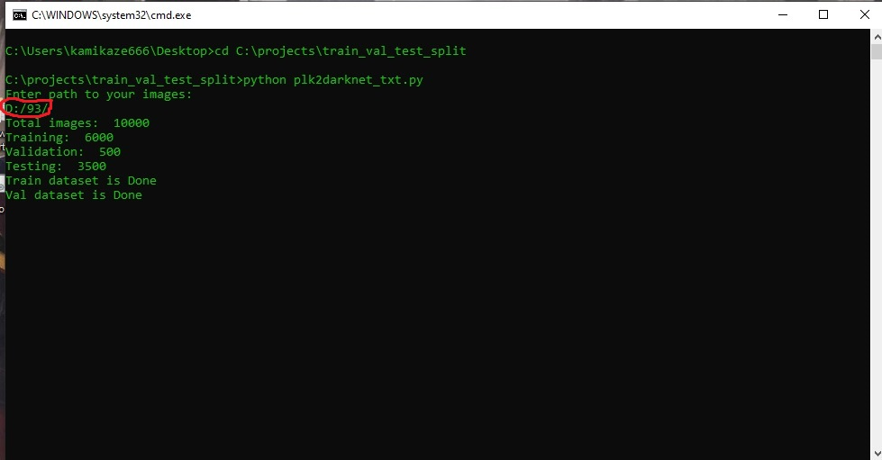
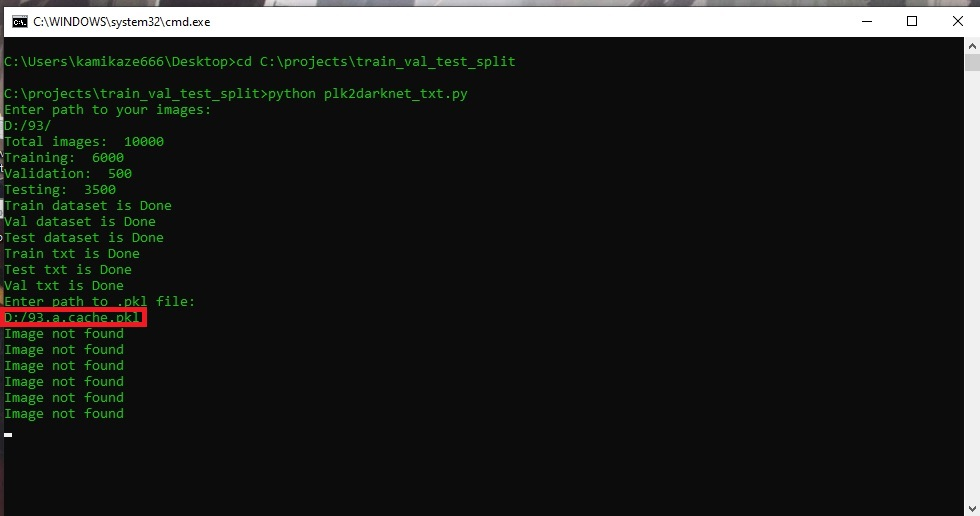
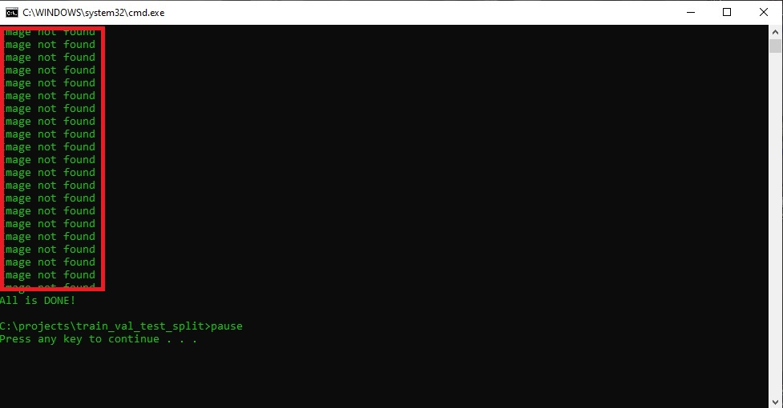
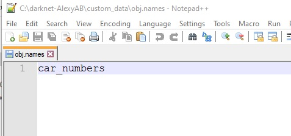
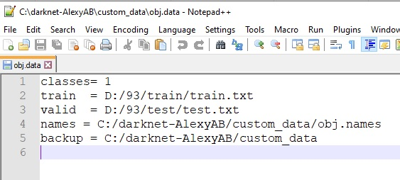
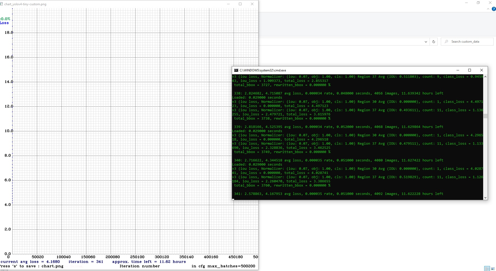
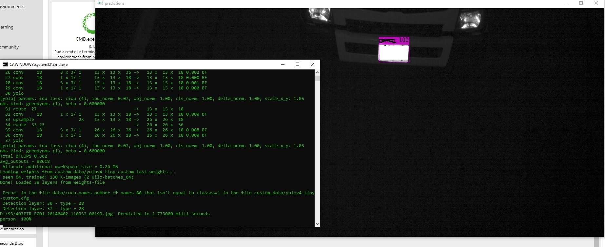

# darknet_data_engineering

***Hello stranger!***

This is a project that converts data for Darknet!

- Clone/Download all of this files!

1. Run **run.bat**

2. Enter path to your image folder

3. Enter path to your Pickle file(.pkl)

4. It's alright then you see "Image not found", script can't find image_name from your dataset with images in .pkl file!

5. Download custom_data folder if you need.

6. Edit file obj.names in the directory darknet\ , with objects names - each in new line:

7. Edit file obj.data in the directory darknet\ , containing (where classes = number of objects):

classes = 2

train  = data/train.txt

valid  = data/test.txt

names = data/obj.names

backup = backup/ 

8. Download pre-trained weights for the convolutional layers and put to the directory darknet\
- for yolov4-tiny.cfg, yolov4-tiny-3l.cfg, yolov4-tiny-custom.cfg (19 MB): [yolov4-tiny.conv.29](https://github.com/AlexeyAB/darknet/releases/download/darknet_yolo_v4_pre/yolov4-tiny.conv.29)

9. Run **train.bat**:

If you start training by using the command line:

- darknet.exe detector train custom_data/obj.data custom_data/yolov4-tiny-custom.cfg yolov4-tiny.conv.29 

10. Run for prediction **detection.bat**:

If you start prediction by using the command line:

- darknet.exe detect custom_data/yolov4-tiny-custom.cfg custom_data/yolov4-tiny-custom_last.weights D:/93/407ETR_FC01_20140402_110333_00199.jpg

